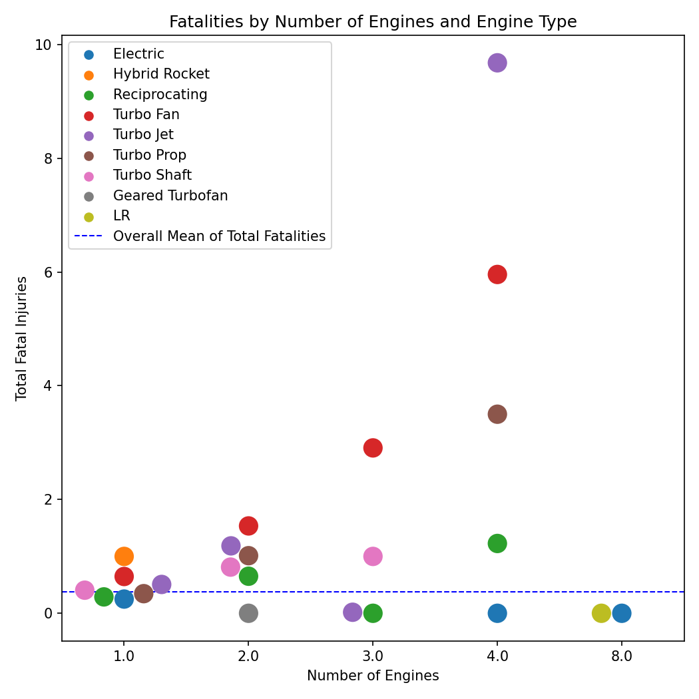

# Airline Safety Analysis

## Project Description
# Overview
With this project is a risk assessment of available commercial airplanes for their safety. Using a dataset from the National Transportation Safety Board we will determine which airplanes provide the highest risk and also which ones provide the lowest.

# Business Problem
Our business problem is that we must determine the airplanes that have the lowest risk factors. Our client's pain points would be how many injuries or fatalities to their customers. We will investigate what are the numbers of injuries and fatalities and if there are any outside circumstances that would account for these numbers (weather, engine type, etc). These are important questions to ask, as our client's investment will not grow if they face endless and costly litigation for running an unsafe airline.

# Data Understanding
Our dataset comes from the National Transportation Safety Board and has data from 1962 to 2023 on civilian aviation accidents and incidents from inside the USA and some from interntional waters. The data represents individual accidents/incidents and includes variables such as the make and model of the aircraft, the number of fatalities and non-fatal injuries, as well as weather information, the number of engines, and whether a plane was manfacturd by an amateur. All of these will factor into our analysis. Our recommendation will be planes with the lowest number of fatalities and injuries.

# Methods

Data was analyzed by various conditions (weather, amateur built, engine type) relationship to the total fatal injury average.
Data was filtered and grouped by airplane make and model
Functions were created to further filter the data to determine if the airplane’s average injuries were lower than the standard deviation and if the number of uninjured passengers was higher than the standard deviation. 
This dataframe was filtered again to show us the safest possible planes.

# Results
Amateur Built planes have on average less total fatal injuries than non-amateur built planes.

Weather factors play a role in increasing the total fatal injuries. The months of June and October having the highest average fatal injuries.

The type of engine correlates to the number of total fatal injuries. In the case of the ‘Turbo Fan’ engine, as the number of engines increases, the number of average total fatal injuries also increases.

The Airbus A380 is the safest plane on average as determined by having the highest number of uninjured passengers with a low average number of total fatalities per accident.

# Conclusions
We would recommend that our client purchase the Airbus A380 as that is our safest plane. We would also recommend avoiding planes with a 'Turbo Fan' engine. We would also recommend to pay particular attentionn to the higher number of fatalities during bad weather, what is called IMC, or instrumental meteorlogical conditions, especially during the months of June and October. And finally that amateur built planes are on average safer than non-Amateur built planes.

# Next Steps

In the future we could improve this project by researching the frequency that each plane is used and contrast that to the number of accidents it is involved with. Additionally, we could map where the most number of accidents occur and also dig into the values represented in 'Report.Status', to determine if human error is a factor in any accidents.

# For More Information
See the full analysis in the Jupyter Notebook or review this presentation.

For additional info, contact Jesse Moore at essereroom@gmail.com

### Tidy Up Your Project

- Change the file name of the Jupyter Notebook (`dsc-phase1-project-template.ipynb`) to something more descriptive
- Save an appropriately-named PDF version of your slide deck to the repository
- Rename the template readme you've been working in by running `git mv TEMPLATE_README.md README.md`
- Delete unnecessary files from the repo using `git rm`
   - The presentation PDF: `DS_Project_Presentation_Template.pdf`
   - Any unused data files in the `zippedData` folder
   - Any unused images in the `images` folder
- Utilize the .gitignore file to ignore large unzipped data files in the `zippedData` folder
   - Add `*.csv`,`*.tsv`, and `*.db` to the .gitignore file

### Submit Your Project

To submit your project, please follow the instructions in the "Project Submission & Review" page in the Milestones course.

***
### Notes

- The visualizations in the notebook use best practices for visualization that you should try to emulate. For example, they have clear axes, descriptive titles, and appropriate number formatting
- The `dsc-phase1-project-template.ipynb` is intended to be the _final version_ of your project. The first notebook you create will not look like this. You are encouraged to start with a very disorderly notebook and clean it as you go
